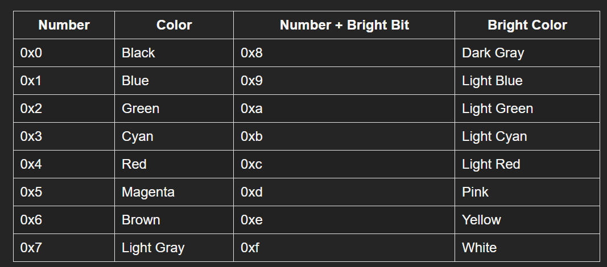

## Building OS in Rust
> ⚠️ Work In Progress

This `kalesh_os` is written taking these articles as [reference](https://os.phil-opp.com/)

### Index 
- [Part 1](#part-1)
- [Part 2](#part-2)
- [Part 3](#part-3)

### Part 1
 Create OS kernel as rust executable without linking the standard library to it. This makes it possible for Rust to run on bare metal without any underlying OS.

To write OS kernel, we want the code to be independent of the OS features. 
By default, Rust crates link the rust standard library to the rust executable providing various OS features like thread, files or networking etc. Also, it uses another C library known as `libc`. 
We can disable the usage of standard library using `no_std` attribute.

Rust standard library provides it's own `panic_handler` implementation, which is the function that gets invoked whenever the panic occurs. After disabling the standard library, we have to write our own implementation.

We cannot have main function, after the standard library is disabled, so we need to disable the main function as well using `#[no_main]`. 

### Stack Unwinding: 
whenever panic occurs, compiler by default performs unwinding of all variables, calling their destructors, cleaning up the memory. This is provided as default implementation of `panic_handler` by rust std. library. But, as we have disabled std. library for compiling directly to bare metal target without any OS features used for creating OS kernel, the unwinding need to be removed as well. Rust provides custom panic implementation, where we can have 2 options for panic, either `abort` or `unwind`. `unwind` is the default option, but we can configure it in the `Cargo.toml` file.

```toml
[profile.dev]
panic = "abort"

[profile.release]
panic = "abort"
```

### Rust program initialization

When you run a typical program (whether it's in Rust, C, Java, or Go), there's quite a bit happening before your main function runs. Think of it like starting up a factory - before the workers (your program's main logic) can begin, someone needs to turn on the lights, start the generators, and ensure all safety systems are operational.

--- 
In a standard Rust program, the startup sequence looks like this:
Operating System → crt0 → Rust Runtime → main function

When you run a rust binary, OS does not directly jump to your rust code. Instead, it first loads and execute `crt0` C runtime library. 

```rust
// Conceptual representation of what crt0 does
fn crt0_start() {
    // Create the initial stack
    let stack = create_stack();
    
    // Set up program arguments and loads them to CPU registers
    let args = prepare_program_arguments();
    
    // Call into the Rust runtime
    rust_start(stack, args); 
}
```

This C runtime, starts the entrypoint of the rust program which is marked by `start` language item.
Language items are special syntax used by the rust compiler for it's execution. 
```rust
#[lang = "start"] // start language item
fn lang_start(main: fn(), argc: isize, argv: *const *const u8) -> isize {
    use panic;
    use sys;
    use sys_common;
    use sys_common::thread_info;
    use thread::Thread;
    #[cfg(not(feature = "backtrace"))]
    use mem;

    sys::init();

    let failed = unsafe {
        let main_guard = sys::thread::guard::init();
        sys::stack_overflow::init();

        // Next, set up the current Thread with the guard information we just
        // created. Note that this isn't necessary in general for new threads,
        // but we just do this to name the main thread and to give it correct
        // info about the stack bounds.
        let thread = Thread::new(Some("main".to_owned()));
        thread_info::set(main_guard, thread);

        // Store our args if necessary in a squirreled away location
        sys::args::init(argc, argv);

        // Let's run some code!
        #[cfg(feature = "backtrace")]
        let res = panic::catch_unwind(|| {
            ::sys_common::backtrace::__rust_begin_short_backtrace(main)
        });
        #[cfg(not(feature = "backtrace"))]
        let res = panic::catch_unwind(mem::transmute::<_, fn()>(main));
        sys_common::cleanup();
        res.is_err()
    };

    if failed {
        101
    } else {
        0
    }
}
```

Rust has a very minimal runtime, which sets up printing a backtrace on panic and stackoverflow guards. 
Runtime finally calls the main function.

For our own OS kernel implemenation, it will not have `crt0` and rust runtime, that's why we need our own entry point. We need to overwrite the `crt0` endpoint directly. Now that we don't have rust runtime, there is also no need of main function, which was supposed to be invoked when the rust runtime sets itself up. So, that's why it was removed before.

### Part 2

When you turn on the computer, it begin executing the firmware code present in the motherboard ROM.
Firmware performs POST(power on, self test) immediately after the device is powered on. 
It detects the available RAM, and looks for hardware components that are non-functional. 
It loads the initial state of device from the firmware. POST routines are part of computer's pre-boot sequence.

On x86 architecture, there are 2 firmware standards: BIOS(Basic Input/Output System) and UEFI(Unified Extensible Firmware Interface).
UEFI is the modern standard with more features, but complex setup. In contrast, BIOS has simple setup, but is really old and have comparatively less features. 

x86 compatible Computer systems have 2 operational or addressing modes: 
1. real mode or read addressing mode
2. protected mode or virtual addressing mode

After the POST routine is completed, bootstrap loader code is invoked to load to Operating system and start booting the OS kernel.
Immediately after POST routine, the hardware initialization occurs:
1. sets up interrupt handlers
2. initializes the display
3. Sets up the services, the boot process might need.

BIOS looks for bootable disks. Once it finds one, the control is transferred to bootloader, which is 512 byte portion of the executable code stored at the starting of the disk. 
Most bootloaders are more than 512 bytes, that's why it's divided into multiple stages. 1st stage being 512 and second stage which is loaded by the 1st stage. 

Bootloader has to determine the location of kernel image on the disk and load it into the memory.   
It also need to switch CPU from 16 bit (real mode) to 32 bit(protected mode) to 64 bit(long mode), where 64 bit registers and complete main memory is available.
It's 3rd job is to query certain information from BIOS and pass it to OS kernel.

Every Bootloader need to be Multiboot standard compliant. This standard defines an interface b/w bootloader and kernel, so that multiboot compliant bootloader can load any multiboot compliant operating system.
To make a kernel Multiboot compliant, one just needs to insert a so-called Multiboot header at the beginning of the kernel file. e.g.  GNU GRUB, which is the most popular bootloader for Linux systems.


### Target Specification
We want to build our rust binary to bare metal target. In cargo, it is done via `--target` parameter.
This is specified as target triple.


The triple has the general format [arch][sub]-[vendor]-[sys]-[env], where:
- arch = x86_64, i386, arm, thumb, mips, etc.
- sub = for ex. on ARM: v5, v6m, v7a, v7m, etc.
- vendor = pc, apple, nvidia, ibm, etc. => unknown in our case.
- sys = none, linux, win32, darwin, cuda, etc.
- env = eabi, gnu, android, macho, elf, etc.

The sub-architecture options are available for their own architectures, of course, so “x86v7a” doesn’t make sense. The vendor needs to be specified only if there’s a relevant change, for instance between PC and Apple. Most of the time it can be omitted (and Unknown) will be assumed, which sets the defaults for the specified architecture. The system name is generally the OS (linux, darwin), but could be special like the bare-metal “none”.

When a parameter is not important, it can be omitted, or you can choose unknown and the defaults will be used. 

Finally, the env (environment) option is something that will pick default CPU/FPU, define the specific behaviour of your code (PCS, extensions), and also choose the correct library calls, etc.

For example, the x86_64-unknown-linux-gnu target triple describes a system with an x86_64 CPU, no clear (unknown) vendor, and a Linux operating system with the GNU ABI(Application binary interface).

For our target system, however, we require some special configuration parameters (e.g. no underlying OS), so none of the existing target triples fits. Fortunately, Rust allows us to define our own target through a JSON file.

Most fields are required by LLVM to generate code for that platform. For example, the data-layout field defines the size of various integer, floating point, and pointer types. Then there are fields that Rust uses for conditional compilation, such as target-pointer-width. The third kind of field defines how the crate should be built. For example, the pre-link-args field specifies arguments passed to the linker.

We will create our target specifications:
```json
{
    "llvm-target": "x86_64-unknown-none",
    "data-layout": "e-m:e-p270:32:32-p271:32:32-p272:64:64-i64:64-i128:128-f80:128-n8:16:32:64-S128",
    "arch": "x86_64",
    "target-endian": "little",
    "target-pointer-width": "64",
    "target-c-int-width": "32",
    "os": "none",
    "executables": true,
    "linker-flavor": "ld.lld",
    "linker": "rust-lld",
    "panic-strategy": "abort",
    "disable-redzone": true,
    "features": "-mmx,-sse,+soft-float",
    "rustc-abi": "x86-softfloat"
}
```
- `arch`: x86_64 CPU architecture
- `data-layout`: defines the size of integer, floating point and pointer types.
- `os: none`, => builds to bare metal target
- `linker: "rust-lld"`, instead of using platform's default linker, we will use here cross platform LLD linker for linking our kernel.
- `linker-flavor: "ld.lld"`: LLD linker rather than gnu or other. We can configure diff. linker flavor using `--flavor` flag.
- `panic-strategy: "abort"`, disable default stack unwinding on panic.
- `"disable-redzone": true`, disables stack pointer optimization known as "red zone", as it would cause stack corruption otherwise. This is done to handle interrupts while writing kernel.

Rust Core library is provided with rust compiler as precompiled binary. So, if we want to use it with our target specification, we have to build the core library according to our target specification as well.

- Create .cargo/config.toml and paste this: 

```bash
[build]
target = "x86_64-kalesh_os.json"

[unstable]
build-std-features = ["compiler-builtins-mem"] ## exposes memset, memcpy and memset like memory related features for the compiler to use
build-std = ["core", "compiler_builtins"] ## This tells cargo it will recompile the core and compiler_builtins(reqd. because it is dependency of core) standard library...
```

That’s where the build-std feature of cargo comes in. It allows to recompile core and other standard library crates on demand, instead of using the precompiled versions shipped with the Rust installation. This feature is very new and still not finished, so it is marked as “unstable” and only available on nightly Rust compilers.


### VGA Text buffer
VGA text mode is a classic display mode used in computers, particularly in the DOS/early PC era. It's basically a simple way to display text on a screen where each character occupies a fixed cell in an 80x25 grid (by default).
The VGA text buffer is a two-dimensional array with typically 25 rows and 80 columns, which is directly rendered to the screen.
The cool thing about VGA text mode is that each character cell contains two bytes:

One byte for the actual ASCII character (like 'A' or '7') [it isn&apos;t exactly ASCII, but a character set named code page 437 with some additional characters and slight modifications]
One byte for the attributes (colors and effects)

The attribute byte breaks down like this:

Bits 0-3: Foreground color (16 colors)
Bits 4-6: Background color (8 colors)
Bit 7: Blink effect (makes text flash)



This is why old DOS programs could have colored text and those cheesy blinking effects. The text mode was super efficient because it only needed to store 4000 bytes (80×25×2) to represent a full screen of colored text, compared to much more memory needed for graphical modes.

For printing “Hello World!”, we just need to know that the buffer is located at address 0xb8000 and that each character cell consists of an ASCII byte and a color byte.
The VGA text buffer is accessible via memory-mapped I/O to the address 0xb8000.
This means that reads and writes to that address don&apos;t access the RAM but directly access the text buffer on the VGA hardware. 

```rust
static HELLO: &[u8] = b"Hello World!";

#[no_mangle]
pub extern "C" fn _start() -> ! {
    let vga_buffer = 0xb8000 as *mut u8;

    for (i, &byte) in HELLO.iter().enumerate() {
        unsafe {
            *vga_buffer.offset(i as isize * 2) = byte;
            *vga_buffer.offset(i as isize * 2 + 1) = 0xb;
        }
    }

    loop {}
}
```

### Running our kernel
Our compiled kernel bare metal code is complete, which will print the "Hello World" to the screen.
Now, we have to convert this compiled binary to bootable disk image and link it to a bootloader. Once, the disk image is created, we can run it on `QEMU` virtual machine.

### Creating Bootimage
we can add bootloader dependency, for booting our kernel. It contains no C dependency and only contain Rust and assembly code. 

```toml
# in Cargo.toml

[dependencies]
bootloader = "0.9"
```

`bootimage` crate compiles the kernel and bootloader and then links them together to create a bootable disk image.

```bash
#!/bin/bash
cargo install bootimage
rustup component add llvm-tools-preview
cargo bootimage
```

The bootimage tool performs the following steps behind the scenes:

- It compiles our kernel to an ELF(Executable and Linkable Format) file.
- It compiles the bootloader dependency as a standalone executable.
- It links the bytes of the kernel ELF file to the bootloader.

When booted, the bootloader reads and parses the appended ELF file. It then maps the program segments to virtual addresses in the page tables, zeroes the .bss section, and sets up a stack. Finally, it reads the entry point address (our _start function) and jumps to it.

### Part 3
In computer programming, a value is said to be volatile if it can be read or modified asynchronously by something other than the current thread of execution. The value of a volatile variable may spontaneously change for reasons such as: sharing values with other threads; sharing values with asynchronous signal handlers; accessing hardware devices via memory-mapped I/O (VGA Hardware in our case). The compiler doesn’t know that we really access VGA buffer memory (instead of normal RAM) and knows nothing about the side effect that some characters appear on the screen. So it might decide that these writes are unnecessary and can be omitted. To avoid this erroneous optimization, we need to specify these writes as volatile. This tells the compiler that the write has side effects and should not be optimized away.

In order to use volatile writes to the buffer, we can `volatile` library.

This library provides `volatile::Volatile` wrapper generic class, which we can use to wrap the screen character and make sure that the writes are unoptimized. This also implements the write and read method for the same.

#### Formatting macros
to support formatting macros, we need to implement `core::fmt::Write` trait, having `write_str` as the required method, which is similar to `write_string`, but with `Result` return type.

```rust
use core::fmt;

impl fmt::Write for Writer {
    fn write_str(&mut self, s: &str) -> fmt::Result {
        self.write_string(s);
        Ok(())
    }
}

```
